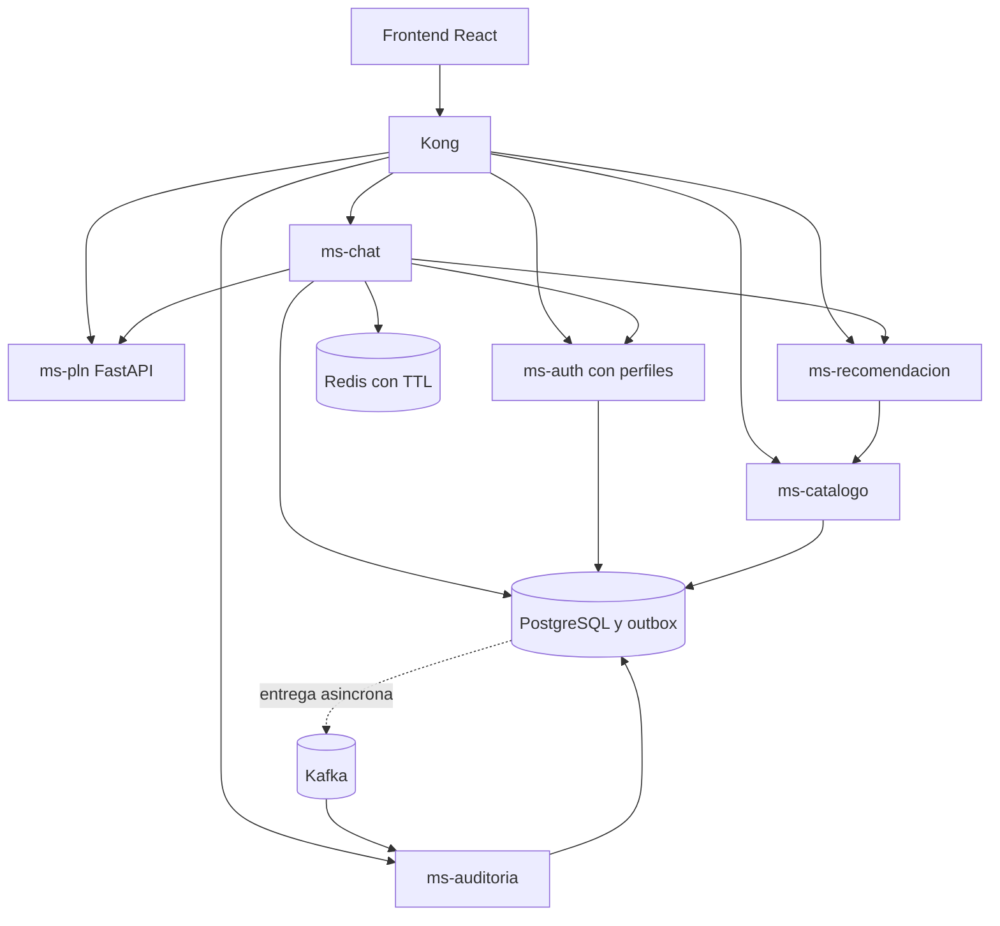

# Contenedores y relaciones

PLN puede colocarse en un grupo de nodos GPU separado mediante gpu-patch.yaml; la inferencia también funciona en CPU. Las relaciones representan el código actual, no una medición de disponibilidad o rendimiento.
