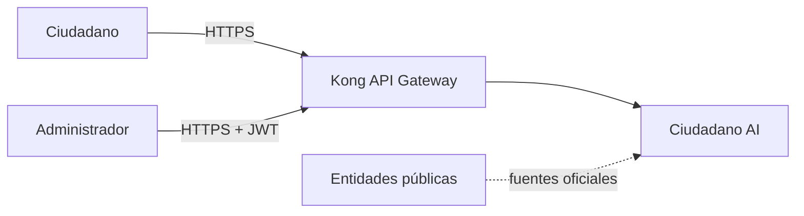
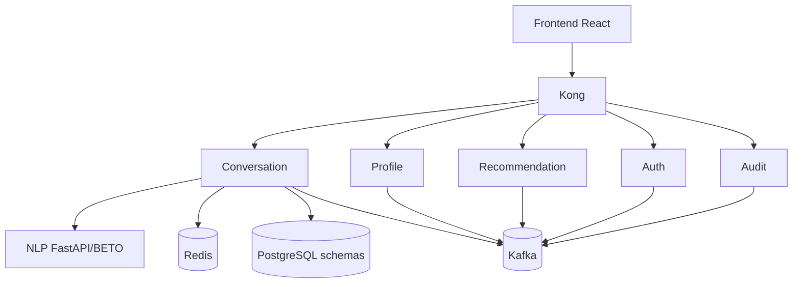
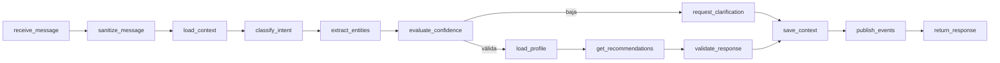

# Diagramas C4 reproducibles

## Nivel 1 — contexto

## Nivel 2 — contenedores

## Nivel 3 — conversación y flujo

Otros diagramas: `docs/architecture/sequence.md`, `docs/architecture/events.md`, `docs/architecture/er.md` y `docs/architecture/deployment.md`.
