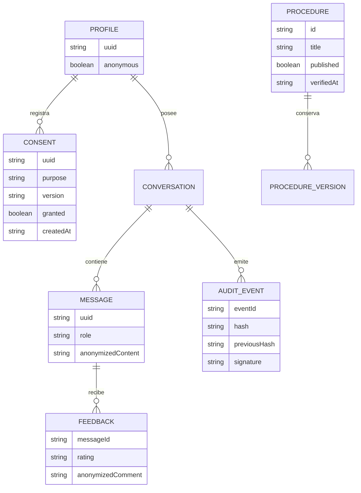

# Modelo lógico

Persistencia física: tablas app_state(namespace,key,data,expires_at), JSON cifrado por agregado y claves de renovación representadas por huellas. No se conserva el texto original de la consulta.
