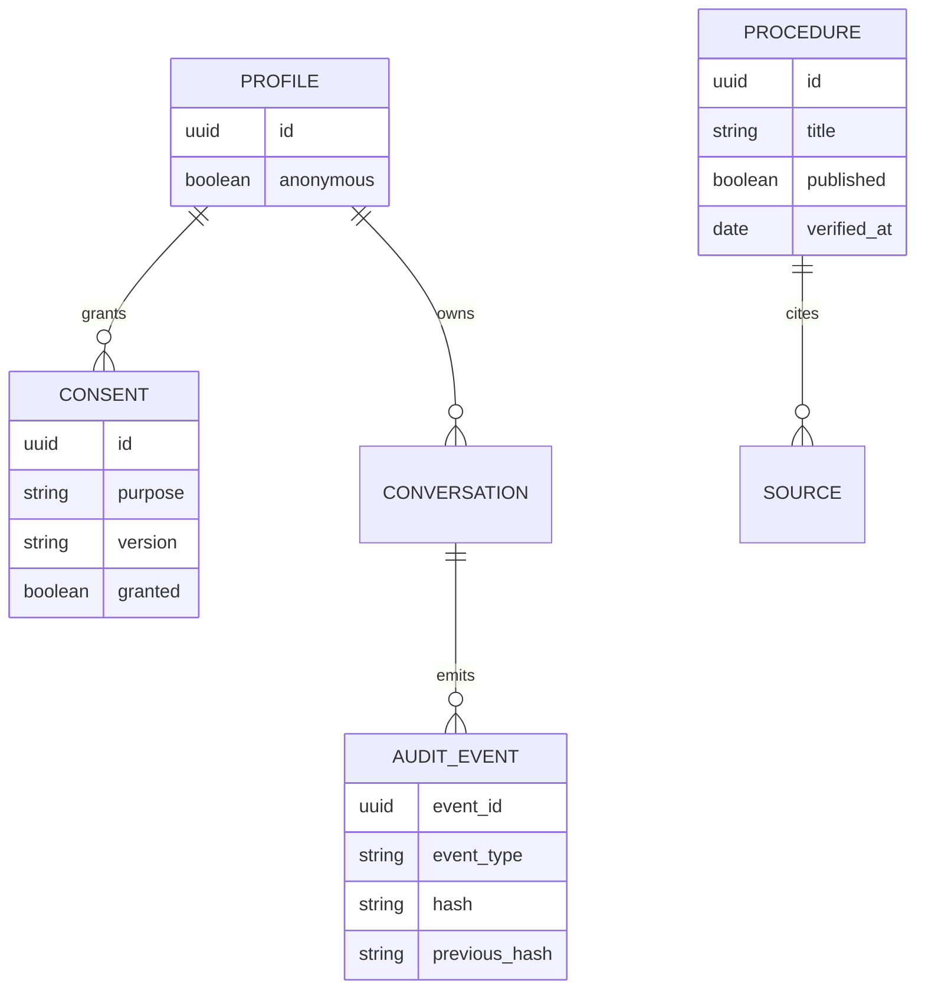

```mermaid
erDiagram
 PROFILE ||--o{ CONSENT : grants
 PROFILE ||--o{ CONVERSATION : owns
 CONVERSATION ||--o{ AUDIT_EVENT : emits
 PROCEDURE ||--o{ SOURCE : cites
 PROFILE { uuid id boolean anonymous }
 CONSENT { uuid id string purpose string version boolean granted }
 PROCEDURE { uuid id string title boolean published date verified_at }
 AUDIT_EVENT { uuid event_id string event_type string hash string previous_hash }
```
