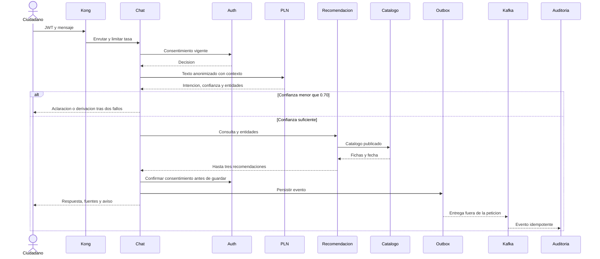

# Secuencia de una consulta

```mermaid
sequenceDiagram
  actor U as Ciudadano
  participant K as Kong
  participant C as Chat
  participant A as Auth
  participant N as PLN
  participant R as Recomendacion
  participant CA as Catalogo
  participant O as Outbox
  participant E as Kafka
  participant AU as Auditoria
  U->>K: JWT y mensaje
  K->>C: Enrutar y limitar tasa
  C->>A: Consentimiento vigente
  A-->>C: Decision
  C->>N: Texto anonimizado con contexto
  N-->>C: Intencion, confianza y entidades
  alt Confianza menor que 0.70
    C-->>U: Aclaracion o derivacion tras dos fallos
  else Confianza suficiente
    C->>R: Consulta y entidades
    R->>CA: Catalogo publicado
    CA-->>R: Fichas y fecha
    R-->>C: Hasta tres recomendaciones
    C->>A: Confirmar consentimiento antes de guardar
    C->>O: Persistir evento
    C-->>U: Respuesta, fuentes y aviso
    O-->>E: Entrega fuera de la peticion
    E-->>AU: Evento idempotente
  end
```
