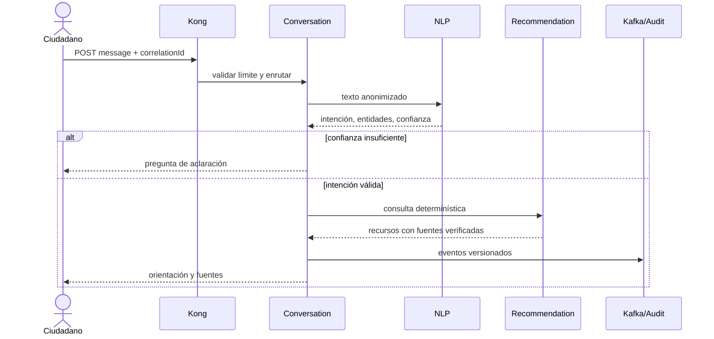

```mermaid
sequenceDiagram
 actor C as Ciudadano
 participant K as Kong
 participant S as Conversation
 participant N as NLP
 participant R as Recommendation
 participant E as Kafka/Audit
 C->>K: POST message + correlationId
 K->>S: validar límite y enrutar
 S->>N: texto anonimizado
 N-->>S: intención, entidades, confianza
 alt confianza insuficiente
  S-->>C: pregunta de aclaración
 else intención válida
  S->>R: consulta determinística
  R-->>S: recursos con fuentes verificadas
  S->>E: eventos versionados
  S-->>C: orientación y fuentes
 end
```
